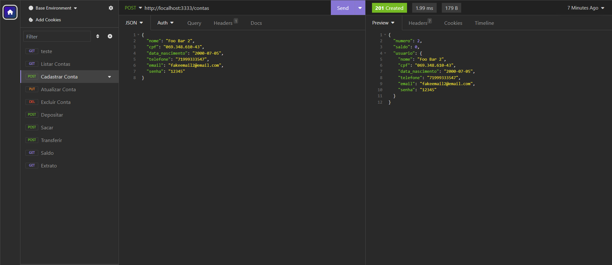
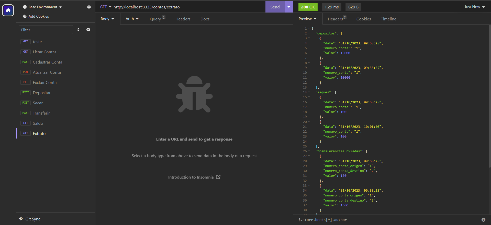

# cubos-bank-project

  
  
  

   

<h1 align="center">
    
</h1>

<h4 align="center"> 
💸 Cubos Bank 💸
</h4>

 <a href="#about">About</a> •
 <a href="#functionalities">Functionalities</a> •
 <a href="#tecnologies">Tecnologies</a> •
  <a href="#run">Run the project</a>

## 💻 About the project

🤑 Cubos Bank- Its a project developed during during the Full Stack Software Development course <a href="https://github.com/cubos-academy" target="_blank">@cubosacademy</a> 

## ⚙️ Functionalities

    
<h1 align="center">
   
</h1>

- [x] Create account
- [x] Update account
- [x] Delete account
- [x] Make bank deposits
- [x] Make bank withdrawals
- [x] Make bank transfers
- [x] Check your balance
- [x] Check your bank statement

## 🛠 Tecnologies

For this project I used :	

	

## 🏃‍♀️ Run the project

 Clone this repository:

### `git@github.com:Kauanedev/cubos-bank-project.git`

Run this code to acess the project before starting:
### `cd cubosBank`

### `npm run start`
Runs the app in the development mode.\
Open [http://localhost:3333](http://localhost:3333) to view it in your browser.
The page will reload when you make changes.\
You may also see any lint errors in the console.

